# 🛠️ Guide Développeur - PO-UX-UI-DATA

## 📋 Table des Matières

1. [Vue d'ensemble](#vue-densemble)
2. [Architecture technique](#architecture-technique)
3. [Installation et configuration](#installation-et-configuration)
4. [Structure du projet](#structure-du-projet)
5. [Développement local](#développement-local)
6. [Tests](#tests)
7. [Déploiement](#déploiement)
8. [Bonnes pratiques](#bonnes-pratiques)
9. [Ressources utiles](#ressources-utiles)

---

## Vue d'ensemble

PO-UX-UI-DATA est une application Next.js complète destinée aux Product Owners spécialisés en UX/UI. Elle intègre les meilleures pratiques agiles, la recherche utilisateur, la gestion de backlog et la visualisation de données.

### Fonctionnalités principales

- **Dashboard UX/Data** : Métriques temps réel et KPIs
- **Roadmap Produit** : Planification trimestrielle
- **Analyse & Wireframes** : Recherche utilisateur, personas, grille wireframes configurable
- **Backlog Product** : Kanban interactif avec drag-and-drop
- **Sprint Management** : Planning et suivi de vélocité
- **Validation & Qualité** : Checklists et tests API

---

## Architecture technique

### Stack principal

```
Frontend : Next.js 14 (App Router) + TypeScript
Styling : TailwindCSS + Shadcn UI
Database : Firebase/Firestore
State : React Context + Custom Hooks
Charts : Chart.js + React-Chartjs-2
Icons : Lucide React
Animation : Framer Motion
```

### Patterns architecturaux

- **Custom Hooks** : Logique métier réutilisable
- **Context API** : Gestion d'état globale
- **Compound Components** : Composants complexes
- **Render Props** : Partage de logique
- **Error Boundaries** : Gestion d'erreurs

### Services métier principaux

#### SprintService (`lib/services/sprintService.ts`)

- `cleanupCompletedSprintsBadges()` : Nettoie les badges des sprints terminés
- `migrateExpiredSprints()` : Migration automatique des sprints expirés
- `debugUserStory(id)` : Debug d'une User Story spécifique
- Gestion du cycle de vie des sprints

#### BacklogTasksService (`lib/services/backlogTasksService.ts`)

- `getAllBacklogTasks()` : Récupère TOUTES les tâches (pas de filtre badge)
- `getActiveSprintTasks()` : Filtre les tâches du sprint actif via userStoryIds
- **⚠️ Important** : Le champ `badge` n'est PLUS utilisé comme critère de filtrage

#### Utilitaires Sprint (`lib/utils/sprintUserStories.ts`)

**🆕 Nouveau système (2025)** : Fonctions centralisées pour le filtrage des sprints

```typescript
// Récupération des User Stories d'un sprint (double source de vérité)
export function getUserStoriesForSprint(
  activeSprint: Sprint | null,
  userStories: UserStory[]
): UserStory[]

// Filtrage des tâches d'un sprint par intersection userStoryIds
export function getTasksForSprint(
  tasks: BacklogTask[],
  sprintUserStoryIds: string[]
): BacklogTask[]
```

**Sources de vérité** :
- **PUSH (prioritaire)** : `sprint.userStoryIds` → Performance optimale
- **PULL (fallback)** : `us.sprintId` → Sécurité contre désynchronisation
- **TASK** : `task.userStoryIds` → Intersection avec sprintUserStoryIds

**❌ Badge déprécié comme critère** :
```typescript
// ❌ ANCIEN (obsolète) :
const activeUserStories = userStories.filter(
  (us) => us.sprintId === currentSprintId && us.badge === "sprint"
);

// ✅ NOUVEAU (2025) :
const activeUserStories = getUserStoriesForSprint(activeSprint, userStories);
```

---

## Installation et configuration

### Prérequis

```bash
Node.js >= 18.0.0
npm >= 8.0.0
Git
```

### Installation rapide

```bash
# Cloner le repository
git clone https://github.com/Florence-Martin/PO-UX-UI-DATA.git
cd PO-UX-UI-DATA

# Installer les dépendances
npm install

# Lancer en développement
npm run dev
```

### Configuration Firebase

1. Créer un projet Firebase
2. Configurer Firestore
3. Ajouter les clés dans `.env.local` :

```env
NEXT_PUBLIC_FIREBASE_API_KEY=your_api_key
NEXT_PUBLIC_FIREBASE_AUTH_DOMAIN=your_project.firebaseapp.com
NEXT_PUBLIC_FIREBASE_PROJECT_ID=your_project_id
NEXT_PUBLIC_FIREBASE_STORAGE_BUCKET=your_project.appspot.com
NEXT_PUBLIC_FIREBASE_MESSAGING_SENDER_ID=your_sender_id
NEXT_PUBLIC_FIREBASE_APP_ID=your_app_id
```

---

## Structure du projet

```
PO-UX-UI-Data/
├── app/                    # Next.js App Router
│   ├── globals.css        # Styles globaux
│   ├── layout.tsx         # Layout principal
│   ├── page.tsx           # Page d'accueil
│   ├── analysis/          # Module d'analyse
│   ├── backlog/           # Gestion du backlog
│   ├── metrics/           # Métriques et KPIs
│   ├── sprint/            # Sprint management
│   └── validation/        # Tests et validation
├── components/            # Composants réutilisables
│   ├── ui/               # Composants UI de base
│   ├── analysis/         # Composants d'analyse
│   ├── backlog/          # Composants backlog
│   ├── dashboard/        # Composants dashboard
│   └── sprint/           # Composants sprint
├── context/              # Contextes React
│   ├── AuthContext.tsx   # Authentification
│   └── TimelineContext.tsx # Timeline
├── hooks/                # Custom hooks
│   ├── useBacklogTasks.ts
│   ├── usePersonas.ts
│   ├── useRoadmap.ts
│   └── useUserStories.ts
├── lib/                  # Utilitaires et services
│   ├── firebase.ts       # Configuration Firebase
│   ├── utils.ts          # Utilitaires généraux
│   ├── services/         # Services métier
│   ├── types/            # Types TypeScript
│   └── utils/            # Utilitaires spécifiques
├── tests/                # Tests unitaires
├── documentation/        # Documentation projet
└── public/               # Assets statiques
```

---

## Développement local

### Scripts disponibles

```bash
npm run dev             # Développement (http://localhost:3000)
npm run build           # Build de production
npm run start           # Serveur de production
npm run lint            # Vérification ESLint
npm run lint:fix        # Correction automatique ESLint
npm run type-check      # Vérification TypeScript (sans build)
npm run format          # Formater le code avec Prettier
npm run format:check    # Vérifier le formatage (CI)
npm run test            # Lancer les tests
npm run test:watch      # Tests en mode watch
npm run test:coverage   # Tests avec rapport de couverture
npm run clean           # Nettoyer et réinstaller
```

### Configuration VSCode recommandée

```json
{
  "editor.formatOnSave": true,
  "editor.codeActionsOnSave": {
    "source.fixAll.eslint": true
  },
  "typescript.preferences.importModuleSpecifier": "relative"
}
```

### Extensions VSCode utiles

- ES7+ React/Redux/React-Native snippets
- Tailwind CSS IntelliSense
- TypeScript Importer
- Auto Rename Tag
- Prettier - Code formatter

---

## 🆕 Architecture Sprint Workflow (2025)

### Vue d'ensemble

Le workflow Sprint a été **complètement refactorisé en novembre 2025** pour éliminer la dépendance au champ `badge` comme critère métier.

#### Principes architecturaux

```
┌─────────────────────────────────────────────────────────────┐
│                    SPRINT WORKFLOW 2.0                      │
├─────────────────────────────────────────────────────────────┤
│                                                             │
│  1. Source de vérité unique                                 │
│     ✅ sprint.userStoryIds (PUSH - prioritaire)            │
│     ✅ userStory.sprintId (PULL - fallback)                │
│     ✅ task.userStoryIds (LINK)                            │
│     ❌ badge (DÉCORATIF uniquement)                        │
│                                                             │
│  2. Fonctions centralisées                                  │
│     📦 getUserStoriesForSprint()                            │
│     📦 getTasksForSprint()                                  │
│                                                             │
│  3. Filtrage cohérent                                       │
│     🎯 Sprint Backlog = Sprint actif (même logique)        │
│                                                             │
│  4. Redirection automatique                                 │
│     🚀 Création → /sprint?tab=kanban (500ms)               │
│                                                             │
└─────────────────────────────────────────────────────────────┘
```

### Pipeline de traitement

```typescript
// 1️⃣ Détection du sprint actif
const { activeSprint } = useActiveSprint();
// Logique : sprint.isActive === true OU date actuelle dans [startDate, endDate]

// 2️⃣ Récupération User Stories (double source de vérité)
const sprintUserStories = getUserStoriesForSprint(activeSprint, userStories);
// PUSH : sprint.userStoryIds (prioritaire)
// PULL : us.sprintId (fallback)

// 3️⃣ Extraction IDs
const sprintUserStoryIds = sprintUserStories.map(us => us.id);

// 4️⃣ Filtrage tâches (intersection)
const sprintTasks = getTasksForSprint(allTasks, sprintUserStoryIds);
// Logique : task.userStoryIds ∩ sprintUserStoryIds

// 5️⃣ Répartition par statut (Kanban)
const sprintTodo = sprintTasks.filter(t => t.status === "todo");
const sprintInProgress = sprintTasks.filter(t => t.status === "in-progress");
const sprintInTesting = sprintTasks.filter(t => t.status === "in-testing");
const sprintDone = sprintTasks.filter(t => t.status === "done");
```

### Fichiers clés

| Fichier | Rôle | Description |
|---------|------|-------------|
| `lib/utils/sprintUserStories.ts` | **Fonctions centralisées** | `getUserStoriesForSprint()`, `getTasksForSprint()` |
| `hooks/sprint/useActiveSprint.tsx` | **Détection sprint actif** | Priorité `isActive`, fallback date range |
| `hooks/sprint/useSprintDetail.tsx` | **Création/modification** | CRUD + redirection automatique |
| `components/backlog/KanbanBoard.tsx` | **Sprint Backlog** | Vue Kanban (exécution) |
| `components/sprint/SprintBoard.tsx` | **Sprint actif** | Vue synthèse (suivi) |

### Flux complet : Création → Affichage

```mermaid
graph LR
    A[Créer Sprint] --> B[updateUserStorySprint]
    B --> C[updateBadgesForSprintUserStories]
    C --> D[toast.success]
    D --> E[refetch]
    E --> F[onClose]
    F --> G[setTimeout 500ms]
    G --> H[router.push /sprint?tab=kanban]
    H --> I[useActiveSprint]
    I --> J[getUserStoriesForSprint]
    J --> K[getTasksForSprint]
    K --> L[Affichage Kanban]
```



### Rôle du champ `badge`

#### ❌ Ancien système (OBSOLÈTE)

```typescript
// ❌ Badge utilisé comme critère de filtrage (FAUX)
const sprintTasks = tasks.filter(task => task.badge === "sprint");
const sprintUS = userStories.filter(us => us.badge === "sprint");
```

**Problèmes** :
- Source de vérité unique → Fragile
- Requêtes Firestore filtrées → Impossible de filtrer côté client
- Risque de désynchronisation

#### ✅ Nouveau système (2025)

```typescript
// ✅ badge conservé uniquement pour synchronisation décorative
// Mis à jour automatiquement via updateBadgesForSprintUserStories()
// JAMAIS utilisé comme critère de filtrage

// Synchronisation automatique
await updateBadgesForSprintUserStories(sprint.userStoryIds);
// → Met badge: "sprint" sur US liées au sprint
// → Met badge: null sur US retirées du sprint
```

**Usages légitimes** :
- 🎨 **Affichage UI** : Chip "Sprint" sur cartes US
- 🔄 **Synchronisation** : Cohérence des données
- 🐛 **Debug** : Visualisation rapide de l'état
- 🔧 **Migration** : Compatibilité avec ancien code

### Points d'attention

#### 1. Timeout de redirection (500ms)

```typescript
// hooks/sprint/useSprintDetail.tsx
setTimeout(() => {
  router.push('/sprint?tab=kanban');
}, 500);
```

**⚠️ Fragilité** : Dépend de la latence réseau  
**✅ Mitigation** : `refetch()` appelé avant + `onSnapshot` temps réel  
**💡 Amélioration future** : Attendre `refetch()` au lieu d'un timeout fixe

#### 2. Double source de vérité (push/pull)

**Complexité** : `sprint.userStoryIds` + `us.sprintId`

**✅ Justification** :
- Performance : Push-first (requêtes optimisées)
- Robustesse : Pull en fallback (désynchronisation)
- Cohérence : `getUserStoriesForSprint()` concilie les deux

#### 3. Badge conservé

**Question** : Pourquoi ne pas supprimer `badge` ?

**Réponses** :
1. Compatibilité avec code existant
2. Migration progressive
3. Utile pour debug et affichage UI
4. Synchronisation automatique

**⚠️ Règle** : Badge **JAMAIS** utilisé comme critère de filtrage

### Bonnes pratiques

```typescript
// ✅ BON : Utiliser les fonctions centralisées
import { getUserStoriesForSprint, getTasksForSprint } from '@/lib/utils/sprintUserStories';

const sprintUS = getUserStoriesForSprint(activeSprint, userStories);
const sprintTasks = getTasksForSprint(allTasks, sprintUS.map(us => us.id));

// ❌ MAUVAIS : Filtrer par badge
const sprintUS = userStories.filter(us => us.badge === "sprint");
const sprintTasks = tasks.filter(task => task.badge === "sprint");

// ✅ BON : Vérifier sprint actif
const { activeSprint } = useActiveSprint();
if (!activeSprint) return <EmptyState />;

// ❌ MAUVAIS : Filtrer manuellement
const activeSprint = sprints.find(s => s.isActive === true);
```

### Documentation complète

📖 Voir `documentation/sprint-workflow-fix.md` pour :
- Diagrammes détaillés du flux
- Code complet de chaque étape
- Tests de validation
- Checklist de débogage
- Évolutions futures

---

## Tests

### Configuration Jest

```javascript
// jest.config.js
module.exports = {
  preset: "ts-jest",
  testEnvironment: "node",
  moduleNameMapper: {
    "^@/(.*)$": "<rootDir>/$1",
  },
  testMatch: [
    "**/__tests__/**/*.?([mc])[jt]s?(x)",
    "**/?(*.)+(spec|test).?([mc])[jt]s?(x)",
    "**/tests/**/*.?([mc])[jt]s?(x)",
  ],
};
```

### Couverture actuelle

- **Tests** : 141 tests passant (100%)
- **Couverture globale** : 100%
- **TypeScript** : Configuration stricte activée
- **Lighthouse Desktop** : Performance 100, Accessibilité 98, Best Practices 96, SEO 100

### Lancer les tests

```bash
# Tests unitaires
npm run test

# Tests en mode watch
npm run test:watch

# Couverture de code
npm run test -- --coverage
```

### Types de tests

```typescript
// Test unitaire basique
describe("progressService", () => {
  it("should calculate progress correctly", () => {
    expect(calculateProgress(5, 10)).toBe(50);
  });
});

// Test avec mock Firebase
jest.mock("@/lib/firebase", () => ({
  db: mockFirestore,
}));

// Test composant React
import { render, screen } from "@testing-library/react";
import Component from "@/components/Component";

test("renders component", () => {
  render(<Component />);
  expect(screen.getByRole("button")).toBeInTheDocument();
});
```

---

## Déploiement

### Vercel (Recommandé)

```bash
# Installation Vercel CLI
npm i -g vercel

# Déploiement
vercel --prod
```

### Variables d'environnement

```env
# Production
NEXT_PUBLIC_FIREBASE_API_KEY=prod_key
NEXT_PUBLIC_FIREBASE_PROJECT_ID=prod_project

# Development
NEXT_PUBLIC_FIREBASE_API_KEY=dev_key
NEXT_PUBLIC_FIREBASE_PROJECT_ID=dev_project
```

### Build de production

```bash
npm run build
npm run start
```

---

## Bonnes pratiques

### Code Style

```typescript
// ✅ Bon
const useUserStories = () => {
  const [stories, setStories] = useState<UserStory[]>([]);

  const addStory = useCallback((story: UserStory) => {
    setStories((prev) => [...prev, story]);
  }, []);

  return { stories, addStory };
};

// ❌ Éviter
function getUserStories() {
  let stories = [];
  // logique complexe...
  return stories;
}
```

### Gestion des erreurs

```typescript
// ✅ Avec try/catch et logger
import { logger } from "@/lib/utils/logger";

const fetchData = async () => {
  try {
    const data = await api.getData();
    logger.info("Données récupérées avec succès");
    return data;
  } catch (error) {
    logger.error("Erreur lors de la récupération des données:", error);
    throw new Error("Failed to fetch data");
  }
};
```

### Système de Logging

Le projet utilise un **système de logging centralisé** qui adapte la verbosité selon l'environnement :

#### Utilisation du logger

```typescript
import { logger } from "@/lib/utils/logger";

// Logs d'information (masqués en production)
logger.info("User story créée:", userStory.code);

// Logs de debug (masqués en production)
logger.debug("Payload Firebase:", data);

// Warnings (masqués en production)
logger.warn("Token expiré, rafraîchissement nécessaire");

// Erreurs (toujours visibles)
logger.error("Erreur lors de la sauvegarde:", error);
```

#### Comportement selon l'environnement

| Environnement | info() | debug() | warn() | error() |
|---------------|--------|---------|--------|---------|
| **Development** | ✅ Visible | ✅ Visible | ✅ Visible | ✅ Visible |
| **Production** | ❌ Masqué | ❌ Masqué | ❌ Masqué | ✅ Visible |

#### ⚠️ Ne PAS utiliser `console.log`

```typescript
// ❌ À ÉVITER - Logs visibles en production
console.log("Debug info");
console.error("Error occurred");

// ✅ BON - Logger adaptatif
logger.debug("Debug info");
logger.error("Error occurred");
```

#### Implémentation

Le logger est défini dans `lib/utils/logger.ts` et vérifie `process.env.NODE_ENV` pour adapter la sortie.

```typescript
// lib/utils/logger.ts
const isDevelopment = process.env.NODE_ENV === "development";

class Logger {
  info(message: string, ...args: any[]): void {
    if (!isDevelopment) return; // Masqué en production
    console.info(`[${new Date().toISOString()}] [INFO]`, message, ...args);
  }

  error(message: string, ...args: any[]): void {
    console.error(`[${new Date().toISOString()}] [ERROR]`, message, ...args);
  }
}
```

### Types TypeScript

```typescript
// ✅ Types explicites
interface UserStory {
  id: string;
  title: string;
  description: string;
  priority: "high" | "medium" | "low";
  status: SprintStatus;
  estimatedPoints: number;
  assignedTo?: string;
}

// ✅ Utilisation des types
const createStory = (data: Partial<UserStory>): UserStory => {
  return {
    id: generateId(),
    status: "todo",
    estimatedPoints: 0,
    ...data,
  } as UserStory;
};
```

### Hooks personnalisés

```typescript
// ✅ Hook réutilisable
const useFirebaseCollection = <T>(
  collectionName: string,
  transformer?: (doc: any) => T
) => {
  const [data, setData] = useState<T[]>([]);
  const [loading, setLoading] = useState(true);
  const [error, setError] = useState<string | null>(null);

  useEffect(() => {
    const fetchData = async () => {
      try {
        setLoading(true);
        const snapshot = await getDocs(collection(db, collectionName));
        const items = snapshot.docs.map((doc) =>
          transformer ? transformer(doc.data()) : doc.data()
        );
        setData(items);
      } catch (err) {
        setError(err.message);
      } finally {
        setLoading(false);
      }
    };

    fetchData();
  }, [collectionName]);

  return { data, loading, error };
};
```

### Composants

```typescript
// ✅ Composant bien structuré
interface ButtonProps {
  variant?: "primary" | "secondary";
  size?: "sm" | "md" | "lg";
  disabled?: boolean;
  onClick?: () => void;
  children: React.ReactNode;
}

const Button: React.FC<ButtonProps> = ({
  variant = "primary",
  size = "md",
  disabled = false,
  onClick,
  children,
}) => {
  const baseClasses = "rounded-lg font-medium transition-colors";
  const variantClasses = {
    primary: "bg-blue-600 text-white hover:bg-blue-700",
    secondary: "bg-gray-200 text-gray-900 hover:bg-gray-300",
  };
  const sizeClasses = {
    sm: "px-3 py-1 text-sm",
    md: "px-4 py-2 text-base",
    lg: "px-6 py-3 text-lg",
  };

  return (
    <button
      className={`${baseClasses} ${variantClasses[variant]} ${sizeClasses[size]}`}
      disabled={disabled}
      onClick={onClick}
    >
      {children}
    </button>
  );
};
```

---

## Ressources utiles

### Documentation officielle

- [Next.js](https://nextjs.org/docs)
- [TypeScript](https://www.typescriptlang.org/docs/)
- [TailwindCSS](https://tailwindcss.com/docs)
- [Firebase](https://firebase.google.com/docs)
- [Shadcn UI](https://ui.shadcn.com/)

### Outils de développement

- [React DevTools](https://reactjs.org/blog/2019/08/15/new-react-devtools.html)
- [Firebase Emulator](https://firebase.google.com/docs/emulator-suite)
- [Vercel CLI](https://vercel.com/docs/cli)

### Ressources d'apprentissage

- [React Patterns](https://reactpatterns.com/)
- [TypeScript Deep Dive](https://basarat.gitbook.io/typescript/)
- [Next.js Examples](https://github.com/vercel/next.js/tree/canary/examples)

---

## 🔧 Dépannage

### Erreurs communes

**Module not found**

```bash
# Vérifier les paths
npm run build
# ou
rm -rf .next node_modules
npm install
```

**Firebase connection issues**

```bash
# Vérifier les variables d'environnement
echo $NEXT_PUBLIC_FIREBASE_API_KEY
```

**Tests qui échouent**

```bash
# Nettoyer le cache Jest
npm test -- --clearCache
```

### Performance

```typescript
// ✅ Optimisations React
const MemoizedComponent = React.memo(MyComponent);

const OptimizedComponent = () => {
  const expensiveValue = useMemo(() => heavyCalculation(data), [data]);

  const handleClick = useCallback(() => {
    // handle click
  }, [dependency]);

  return <div>{expensiveValue}</div>;
};
```

---

**Auteur** : Florence Martin - PO / UX/UI / Frontend Developer  
**Dernière mise à jour** : Septembre 2025  
**Version** : 1.0.0
