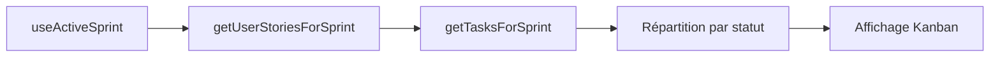
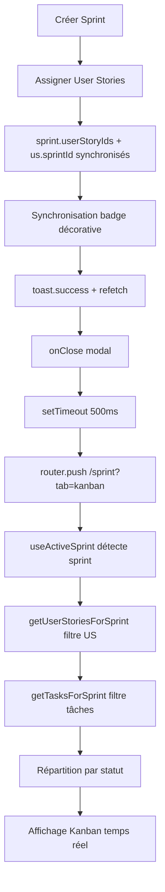

# 🔧 Workflow Sprint - Architecture & Refactoring (2025)

> **📅 Dernière mise à jour** : 27 novembre 2025  
> **🎯 Objectif** : Documentation du nouveau flux Sprint après refactoring complet

## 🆕 Nouveau flux Sprint (2025)

### Vue d'ensemble

Le workflow Sprint a été **complètement refactorisé** pour éliminer la dépendance au champ `badge` comme critère métier. Le système repose désormais sur :

1. **Source de vérité unique** : `sprint.userStoryIds` + `userStory.sprintId` + `task.userStoryIds`
2. **Fonctions centralisées** : `getUserStoriesForSprint()` et `getTasksForSprint()`
3. **Filtrage cohérent** : Sprint Backlog et Sprint actif utilisent la même logique
4. **Redirection automatique** : Navigation fluide après création de sprint

### Architecture technique

### Architecture technique

```typescript
// 📦 Fichiers clés du nouveau système
lib/utils/sprintUserStories.ts          // Fonctions centralisées de filtrage
hooks/sprint/useActiveSprint.tsx        // Détection du sprint actif
components/backlog/KanbanBoard.tsx      // Sprint Backlog (Kanban)
components/sprint/SprintBoard.tsx       // Sprint actif (vue synthèse)
hooks/sprint/useSprintDetail.tsx        // Création/modification + redirection
```

### Pipeline de traitement



---

## 🔄 Flux complet : Création Sprint → Affichage

### Étape 1 : Création du sprint

**Fichier** : `hooks/sprint/useSprintDetail.tsx` (lignes 76-148)

```typescript
// 1. Création du sprint dans Firestore
const sprint = {
  title, goal, startDate, endDate,
  userStoryIds: ["us1", "us2", "us3"], // ✅ Source de vérité (push)
  isActive: true,
  status: "planned"
}
await createSprint(sprint);

// 2. Mise à jour des User Stories
for (const usId of userStoryIds) {
  await updateUserStorySprint(usId, sprintId);
  // Ajoute : us.sprintId = sprint.id  // ✅ Source de vérité (pull)
  // Ajoute : us.badge = "sprint"      // ⚠️ Décoratif uniquement
}

// 3. Synchronisation des badges (décoratif)
await updateBadgesForSprintUserStories(userStoryIds);

// 4. Notification utilisateur
toast.success("Sprint créé avec succès !");

// 5. Rafraîchissement des données
await refetch(); // Recharge la liste des sprints (onSnapshot)

// 6. Fermeture du modal
onClose();

// 7. ✨ REDIRECTION AUTOMATIQUE (NOUVEAU)
setTimeout(() => {
  router.push('/sprint?tab=kanban'); // Navigation vers Sprint Backlog
}, 500); // Délai pour propagation Firestore + refetch
```

**⚠️ Point d'attention** : Le timeout de 500ms permet :
- La propagation des données dans Firestore
- Le rafraîchissement des hooks (`useActiveSprint`, `useUserStories`, `useBacklogTasks`)
- L'affichage du toast de succès

---

### Étape 2 : Détection du sprint actif

**Fichier** : `hooks/sprint/useActiveSprint.tsx`

```typescript
export function useActiveSprint() {
  const { sprints } = useSprints();
  
  const activeSprint = sprints.find(sprint => {
    // Priorité 1 : Flag isActive
    if (sprint.isActive === true) return true;
    
    // Priorité 2 : Date range + status
    const now = new Date();
    const start = sprint.startDate?.toDate();
    const end = sprint.endDate?.toDate();
    
    return (
      start && end &&
      now >= start && now <= end &&
      sprint.status !== "done"
    );
  }) || null;
  
  return { activeSprint };
}
```

**✅ Source de vérité** : `sprint.isActive` ou plage de dates

---

### Étape 3 : Récupération des User Stories du sprint

**Fichier** : `lib/utils/sprintUserStories.ts` (fonction `getUserStoriesForSprint`)

```typescript
/**
 * ✅ DOUBLE SOURCE DE VÉRITÉ (PUSH + PULL)
 * 
 * PUSH (prioritaire) : sprint.userStoryIds = ["us1", "us2"]
 *   → Performance optimale (pas de parcours de toutes les US)
 *   → Requête directe sur les IDs stockés dans le sprint
 * 
 * PULL (fallback) : us.sprintId = "sprint_id"
 *   → Sécurité en cas de désynchronisation
 *   → Garantit qu'aucune US liée au sprint n'est oubliée
 */
export function getUserStoriesForSprint(
  activeSprint: Sprint | null,
  userStories: UserStory[]
): UserStory[] {
  if (!activeSprint) return [];
  
  const sprintUserStoryIds = activeSprint.userStoryIds ?? [];
  
  // MODE PUSH : Filtrer par sprint.userStoryIds
  const pushUserStories = userStories.filter(us =>
    sprintUserStoryIds.includes(us.id)
  );
  
  // MODE PULL : Filtrer par us.sprintId (fallback)
  const pullUserStories = userStories.filter(us =>
    us.sprintId === activeSprint.id &&
    !sprintUserStoryIds.includes(us.id) // Éviter doublons
  );
  
  // Fusion des deux sources
  return [...pushUserStories, ...pullUserStories];
}
```

**✅ Avantages** :
- **Performance** : Push-first (pas besoin de scanner toutes les US)
- **Robustesse** : Pull en fallback (récupère US désynchronisées)
- **Cohérence** : Les deux sources sont conciliées automatiquement

---

### Étape 4 : Filtrage des tâches du sprint

**Fichier** : `lib/utils/sprintUserStories.ts` (fonction `getTasksForSprint`)

```typescript
/**
 * ✅ FILTRAGE PAR INTERSECTION
 * 
 * Une tâche appartient au sprint SI :
 *   task.userStoryIds intersecte sprintUserStoryIds
 * 
 * ❌ Le champ badge N'EST PLUS utilisé comme critère de filtrage
 */
export function getTasksForSprint(
  tasks: BacklogTask[],
  sprintUserStoryIds: string[]
): BacklogTask[] {
  return tasks.filter(task =>
    task.userStoryIds?.some(usId =>
      sprintUserStoryIds.includes(usId)
    )
  );
}
```

**✅ Source de vérité** : `task.userStoryIds` ∩ `sprintUserStoryIds`

---

### Étape 5 : Affichage dans le Sprint Backlog

**Fichier** : `components/backlog/KanbanBoard.tsx`

```typescript
export function KanbanBoard() {
  // 1️⃣ Récupération du sprint actif
  const { activeSprint } = useActiveSprint();
  
  // 2️⃣ Récupération de toutes les User Stories
  const { userStories } = useUserStories();
  
  // 3️⃣ Récupération de toutes les tâches (temps réel via onSnapshot)
  const { todo, inProgress, inTesting, done } = useBacklogTasks();
  
  // 4️⃣ Filtrage des US du sprint (fonction centralisée)
  const sprintUserStories = getUserStoriesForSprint(activeSprint, userStories);
  const sprintUserStoryIds = sprintUserStories.map(us => us.id);
  
  // 5️⃣ Filtrage des tâches du sprint (fonction centralisée)
  const allTasksFromHook = [...todo, ...inProgress, ...inTesting, ...done];
  const sprintTasks = getTasksForSprint(allTasksFromHook, sprintUserStoryIds);
  
  // 6️⃣ Répartition par statut pour le Kanban
  const sprintTodo = sprintTasks.filter(t => t.status === "todo");
  const sprintInProgress = sprintTasks.filter(t => t.status === "in-progress");
  const sprintInTesting = sprintTasks.filter(t => t.status === "in-testing");
  const sprintDone = sprintTasks.filter(t => t.status === "done");
  
  return (
    <div className="grid grid-cols-4 gap-4">
      <KanbanColumn title="À faire" tasks={sprintTodo} status="todo" />
      <KanbanColumn title="En cours" tasks={sprintInProgress} status="in-progress" />
      <KanbanColumn title="En test" tasks={sprintInTesting} status="in-testing" />
      <KanbanColumn title="Terminé" tasks={sprintDone} status="done" />
    </div>
  );
}
```

**✅ Temps réel** : `useBacklogTasks()` utilise `onSnapshot` Firestore → pas besoin de rafraîchir manuellement

---

### Étape 6 : Affichage dans Sprint actif

**Fichier** : `components/sprint/SprintBoard.tsx`

```typescript
export function SprintBoard() {
  const { activeSprint } = useActiveSprint();
  const { userStories } = useUserStories();
  const { tasks } = useBacklogTasks();
  
  const sprintUserStoryIds = activeSprint.userStoryIds ?? [];
  
  // ✅ Filtrage manuel (équivalent à getUserStoriesForSprint)
  // NOTE : Logique équivalente aux fonctions centralisées
  //        mais implémentée manuellement pour performance (pas d'import)
  const sprintUserStories = userStories.filter(us =>
    sprintUserStoryIds.includes(us.id)
  );
  
  // ✅ Filtrage manuel (équivalent à getTasksForSprint)
  const sprintTasks = tasks.filter(task =>
    task.userStoryIds?.some(id => sprintUserStoryIds.includes(id))
  );
  
  return (
    <div>
      {/* Vue synthèse : Velocity, burndown, DoD, etc. */}
    </div>
  );
}
```

**✅ Équivalence validée** : SprintBoard et KanbanBoard utilisent la **même logique** de filtrage

---

## ⚙️ Rôle du champ `badge`

### ❌ Ancien système (OBSOLÈTE)

```typescript
// ❌ Badge utilisé comme critère de filtrage métier
const sprintTasks = tasks.filter(task => task.badge === "sprint");
const sprintUS = userStories.filter(us => us.badge === "sprint");

// ❌ Requête Firestore avec WHERE badge = "sprint"
const query = query(
  collection(db, "backlog_tasks"),
  where("badge", "==", "sprint")
);
```

**Problèmes** :
- Badge = source de vérité unique → Fragile
- Requêtes Firestore filtrées → Impossibilité de filtrer côté client
- Synchronisation manuelle → Risque de désynchronisation
- Pas de double source de vérité → Perte de données si badge non mis à jour

---

### ✅ Nouveau système (2025)

```typescript
// ✅ badge conservé uniquement pour synchronisation décorative
// Mis à jour automatiquement via updateBadgesForSprintUserStories()
// JAMAIS utilisé comme critère de filtrage

// Exemple : Synchronisation automatique
await updateBadgesForSprintUserStories(sprint.userStoryIds);
// → Met badge: "sprint" sur les US liées au sprint
// → Met badge: null sur les US retirées du sprint
// → Synchronise badge des tâches en fonction de leurs userStoryIds
```

**✅ Avantages** :
- Badge = champ décoratif → Peut être affiché en UI (chip, couleur)
- Synchronisation automatique → Cohérence des données
- Pas de critère métier → Pas de risque de perte de données
- Double source de vérité → `sprintId` + `userStoryIds` = sources fiables

**🎨 Usages légitimes du badge** :
1. **Affichage UI** : Chip "Sprint" sur les cartes US
2. **Synchronisation** : Maintien de la cohérence des données
3. **Debug** : Visualisation rapide de l'état d'une entité
4. **Migration** : Conservation pour compatibilité avec ancien code

---

## 🚀 Workflow final attendu



---

## 📋 Sources de vérité

### Hiérarchie des données

| Entité | Champs métier | Champ décoratif | Usage |
|--------|---------------|-----------------|-------|
| **Sprint** | `userStoryIds: string[]` | - | Push : Liste des US du sprint |
| **User Story** | `sprintId: string \| null` | `badge: "sprint" \| null` | Pull : Référence au sprint |
| **Task** | `userStoryIds: string[]` | `badge: "sprint" \| null` | Lien : US parentes |

### Règles de filtrage

1. **Sprint actif** : `useActiveSprint()` → `sprint.isActive` ou date range
2. **US du sprint** : `getUserStoriesForSprint()` → `sprint.userStoryIds` (push) + `us.sprintId` (pull)
3. **Tâches du sprint** : `getTasksForSprint()` → `task.userStoryIds` ∩ `sprintUserStoryIds`
4. **Badge** : ❌ **JAMAIS utilisé comme critère de filtrage**

---

## ⚠️ Points d'attention

### 1. Timeout de redirection (500ms)

**Code** : `setTimeout(() => router.push('/sprint?tab=kanban'), 500);`

**Raison** :
- Permet la propagation des données dans Firestore
- Laisse le temps à `refetch()` de se propager dans les hooks
- Affiche le toast de succès avant navigation

**⚠️ Fragilité** :
- Dépend de la latence réseau et de Firestore
- Si réseau lent → Risque de redirection avant rafraîchissement complet

**✅ Mitigation** :
- `refetch()` appelé avant le timeout
- `useActiveSprint()` utilise `onSnapshot` (temps réel)
- Délai de 500ms est un compromis raisonnable

**💡 Amélioration future possible** :
```typescript
// Attendre la fin de refetch() au lieu d'un timeout fixe
await refetch();
router.push('/sprint?tab=kanban');
```

---

### 2. Double source de vérité (push/pull)

**Complexité** : Deux endroits où le lien sprint ↔ US est stocké
- `sprint.userStoryIds` (push)
- `us.sprintId` (pull)

**✅ Justification** :
- **Performance** : `sprint.userStoryIds` permet requêtes optimisées
- **Robustesse** : `us.sprintId` en fallback récupère US désynchronisées
- **Cohérence** : `getUserStoriesForSprint()` concilie les deux sources

**⚠️ Risque** :
- Désynchronisation si mise à jour partielle
- Complexité de maintenance

**✅ Mitigation** :
- Logique centralisée dans `getUserStoriesForSprint()`
- Synchronisation automatique via `updateUserStorySprint()`
- Tests unitaires sur la conciliation push/pull

---

### 3. Badge conservé pour synchronisation

**Question** : Pourquoi ne pas supprimer complètement le champ `badge` ?

**Réponses** :
1. **Compatibilité** : Code existant peut encore l'utiliser en UI
2. **Migration progressive** : Permet transition douce
3. **Debug** : Utile pour visualiser l'état d'une entité
4. **Synchronisation** : Maintient cohérence pour affichage

**⚠️ Attention** :
- Badge ne doit **JAMAIS** être utilisé comme critère de filtrage
- Synchronisation automatique via `updateBadgesForSprintUserStories()`
- Peut être supprimé à l'avenir si non utilisé en UI

---

### 4. SprintBoard vs KanbanBoard (duplication)

**Observation** : Les deux composants filtrent les tâches différemment
- `KanbanBoard` : Utilise `getTasksForSprint()` (fonction centralisée)
- `SprintBoard` : Filtrage manuel équivalent

**✅ Justification** :
- **Performance** : SprintBoard évite imports inutiles
- **Équivalence** : Logique identique, commentaires ajoutés
- **Flexibilité** : Chaque composant peut optimiser son code

**💡 Évolution future** :
- Unifier les deux approches si nécessaire
- Pour l'instant, les deux sont valides et documentées

---

## 🧪 Tests de validation

### Test 1 : Création de sprint

```typescript
// 1. Créer un sprint "Sprint Test 28"
// 2. Sélectionner 3 User Stories
// 3. Cocher "Marquer comme sprint actif"
// 4. Cliquer "Créer"

// ✅ Attendu :
// - Toast "Sprint créé avec succès !"
// - Redirection vers /sprint?tab=kanban après 500ms
// - Sprint Backlog affiche les tâches des 3 US
// - Tâches réparties dans les colonnes selon leur status
```

### Test 2 : Création de tâche

```typescript
// 1. Aller sur Sprint Backlog
// 2. Cliquer "+ Créer tâche"
// 3. Sélectionner une US du sprint (liste restreinte)
// 4. Remplir titre, description, priorité
// 5. Cliquer "Créer"

// ✅ Attendu :
// - Tâche visible immédiatement dans colonne "À faire"
// - getTasksForSprint() inclut la nouvelle tâche
// - Temps réel : pas besoin de rafraîchir
```

### Test 3 : Navigation Sprint actif ↔ Sprint Backlog

```typescript
// 1. Aller sur Sprint actif (tab=board)
// 2. Vérifier que les mêmes tâches sont affichées
// 3. Aller sur Sprint Backlog (tab=kanban)
// 4. Vérifier que les mêmes tâches sont affichées

// ✅ Attendu :
// - Cohérence totale entre les deux vues
// - Même logique de filtrage (sprintUserStoryIds)
```

---

## 📝 Checklist de débogage

### Sprint actif

- [ ] `useActiveSprint()` retourne bien le sprint ?
- [ ] `sprint.isActive === true` ou date range valide ?
- [ ] `sprint.status !== "done"` ?

### User Stories

- [ ] `sprint.userStoryIds` contient bien les IDs ?
- [ ] `us.sprintId === sprint.id` pour chaque US ?
- [ ] `getUserStoriesForSprint()` retourne toutes les US attendues ?

### Tâches

- [ ] Tâches créées dans Firestore ?
- [ ] `task.userStoryIds` contient bien l'ID de l'US parente ?
- [ ] `getTasksForSprint()` retourne toutes les tâches attendues ?
- [ ] Tâches réparties correctement par `status` ?

### Badge (décoratif)

- [ ] `us.badge === "sprint"` après création ? (synchronisation OK)
- [ ] `task.badge === "sprint"` si liée à une US du sprint ?
- [ ] Badge **NON utilisé** comme critère de filtrage ?

### Redirection

- [ ] Toast affiché avant redirection ?
- [ ] `refetch()` appelé avant `router.push()` ?
- [ ] Délai de 500ms suffisant ?
- [ ] Navigation vers `/sprint?tab=kanban` ?

---

## 🚀 Prochaines améliorations

### Court terme

1. **Améliorer la redirection** : Attendre `refetch()` au lieu d'un timeout fixe
2. **Tests unitaires** : Couvrir `getUserStoriesForSprint()` et `getTasksForSprint()`
3. **Documentation UI** : Tooltip expliquant le rôle du badge

### Moyen terme

1. **Unifier SprintBoard/KanbanBoard** : Utiliser les mêmes fonctions centralisées
2. **Optimistic UI** : Afficher tâches immédiatement sans attendre Firestore
3. **Real-time avancé** : WebSocket pour mise à jour instantanée multi-utilisateurs

### Long terme

1. **Supprimer badge** : Si non utilisé en UI, retirer complètement
2. **Source de vérité unique** : Évaluer si push/pull est toujours nécessaire
3. **State management** : Zustand/Redux pour gérer état global

---

## 📚 Références

### Fichiers clés

```
lib/utils/sprintUserStories.ts          # Fonctions centralisées
hooks/sprint/useActiveSprint.tsx        # Détection sprint actif
hooks/sprint/useSprintDetail.tsx        # Création/modification
components/backlog/KanbanBoard.tsx      # Sprint Backlog
components/sprint/SprintBoard.tsx       # Sprint actif
lib/services/backlogTasksService.ts     # Services tâches
```

### Commits importants

- Refactoring Sprint Workflow (27/11/2025)
- Suppression filtrage badge (27/11/2025)
- Ajout redirection automatique (27/11/2025)

---

**Auteur** : Florence Martin - PO / UX/UI / Frontend Developer  
**Dernière mise à jour** : 27 novembre 2025  
**Version** : 2.0 (Refactoring complet)
